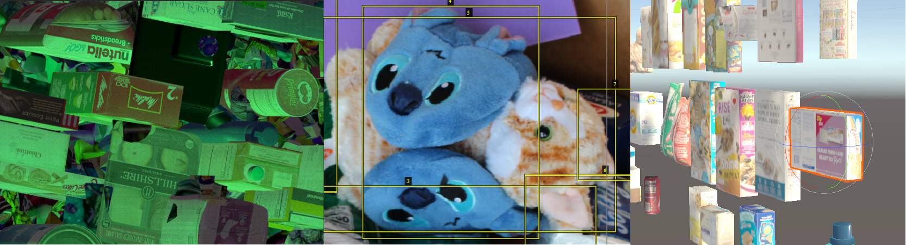

# SynthDet: An end-to-end object detection pipeline using synthetic data  
[](LICENSE.md)
## Overview 
SynthDet is an open source project that demonstrates an end-to-end object detection pipeline using synthetic image data. The project includes all the code and assets for generating a synthetic dataset in Unity. Using recent [research](#Citation), SynthDet utilizes Unity Perception package to generate highly randomized images of 64 common grocery products (example: cereal boxes and candy) and export them along with appropriate labels and annotations (2D bounding boxes). The synthetic dataset generated can then be used to train a deep learning based object detection model.
This project is geared towards ML practitioners and enthusiasts who are actively exploring synthetic data or just looking to get started. 

### [Getting started with SynthDet](docs/Readme.md)

## Contents 
* SynthDet - Unity Perception sample project
* 3D Assets - High quality models of 64 commonly found grocery products
* Unity Perception package
* Unity Dataset Insights Python package

## Inspiration
SynthDet was inspired by the following research paper from Google Cloud AI:  

Hinterstoisser, S., Pauly, O., Heibel, H., Marek, M., & Bokeloh, M. (2019). [*An Annotation Saved is an Annotation Earned: Using Fully Synthetic Training for Object Instance Detection.* ](https://arxiv.org/pdf/1902.09967.pdf)

## Support 
For general questions or concerns please contact the Perception team at perception@unity3d.com

For feedback, bugs, or other issues please file a github issue and the Perception team will investigate the issue as soon as possible.

## Citation
If you find this package useful, consider citing it using:

```
@misc{synthdet2020,
    title={Training a performant object detection {ML} model on synthetic data using {U}nity {P}erception tools},
    author={You-Cyuan Jhang and Adam Palmar and Bowen Li and Saurav Dhakad and Sanjay Kumar Vishwakarma and Jonathan Hogins and Adam Crespi and Chris Kerr and Sharmila Chockalingam and Cesar Romero and Alex Thaman and Sujoy Ganguly},
    howpublished = {\url{https://blogs.unity3d.com/2020/09/17/training-a-performant-object-detection-ml-model-on-synthetic-data-using-unity-perception-tools/}},
    journal={Unity Techonologies Blog},
    publisher={Unity Technologies},
    year={2020},
    month={Sep}
}
```

## Additional Resources
[GTC 2020: Synthetic Data: An efficient mechanism to train Perception Systems](https://developer.nvidia.com/gtc/2020/video/s22700)

[Synthetic data: Simulating myriad possibilities to train robust machine learning models](https://blogs.unity3d.com/2020/05/01/synthetic-data-simulating-myriad-possibilities-to-train-robust-machine-learning-models/)

[Use Unity’s perception tools to generate and analyze synthetic data at scale to train your ML models](https://blogs.unity3d.com/2020/06/10/use-unitys-perception-tools-to-generate-and-analyze-synthetic-data-at-scale-to-train-your-ml-models/)

[Training a performant object detection ML model on synthetic data using Unity Perception tools](https://blogs.unity3d.com/2020/09/17/training-a-performant-object-detection-ml-model-on-synthetic-data-using-unity-perception-tools/)

## License
[Apache License 2.0](LICENSE.md)