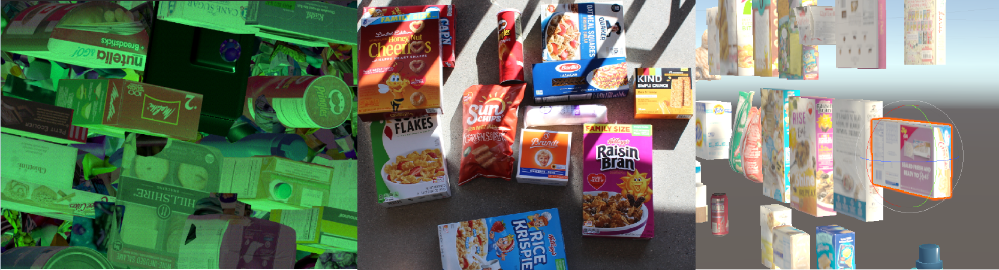

# Unity SynthDet 
In this current deliverable, the primary elements that we are including are the Perception SDK, annotation data,using Thea for creating trained data models, and execution of simulations on the local machine or Unity Simulation platform.

## Features
* Unity SynthDet project that includes all the code and assets for reproducing the synthetic dataset for this paper at scale in Unity Simulation
* AR Example App to is a standalone desktop application that takes a model trained by Thea and runs it on a webcam input, showing boxes of detected objects
* Using Unity Simulation to run and reproduce a synthetic dataset
* Annotated real-world dataset that contains a set of >1000 photos alongside labeled bounding box annotations in the form of the COCO dataset
* Thea is python based toolset that code for model training, testing, and dataset insights.
* Perception SDK

## Release & Documentation
#### Click [here](docs/Readme.md) to get the started with SynthDet

Version|Release Date |Source
-------|-------------|------
xxxx   |April X, 2020|[source](https://github.com/Unity-Technologies/SynthDet)

## Citation
Here are some additional, relevant articles:
* [Using Fully Synthetic Training for Object Instance Detection](https://arxiv.org/pdf/1902.09967.pdf)

## Additional Resources 
Public annotated dataset [gcs](https://storage.cloud.google.com/thea-dev/data/groceries/v1.zip?authuser=0)

## License
* [License]()
