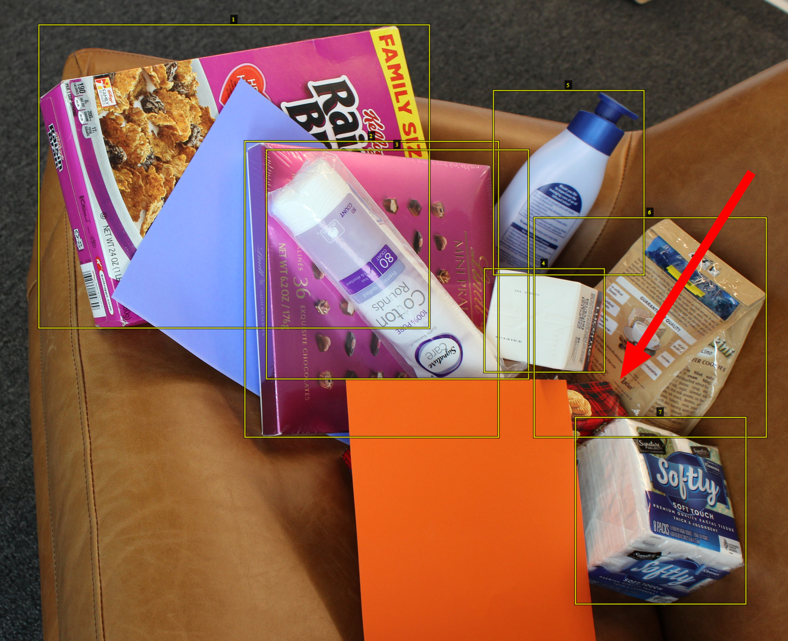

# Annotated Dataset 

## Real World Annotated Dataset 
We have a public annotated dataset that is currently being hosted in [gcs]() for users to download.

## Synthetic vs Realworld 

## Synthentic Data
Training using synthetic data models is very attrective because large amount of datasets can be generated to train models without of a large cost. 
While creating the background images seen in this sample project we applied random lighting, noise, and blur to the images to provide a more robust enviroment for the model to train on.
Synthentic data allows the precise control of the the rendering procces of the images to include various properties of the image.

## Real World Data
Real world data is extremely costly and time consuming to produce and error prone. This can become a large limitation on creating real world datasets that can be used 
to train models.

## Deep Learing
Deep learing requires vast amount of training data to reach results in order to reach state of the art results 

## Domain Randomization 
Currently the stragety for creating purely synthetic images to be used for training object detection. 
Random poses of objects
Random Noise
Random Blur
Random Color Illumination

## Synthetic Images with spatial and ambient variations