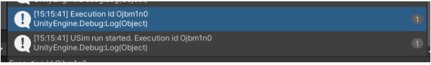

# Getting Started with Unity SynthDet

The purpose of this document is to provide you with everything that you need to get started in using the sample project. 

## Workflow (Step-by-step)
### Step 1: Open the SynthDet Sample project
1. Git clone the SynthDet repo from the [GitHub](https://github.com/Unity-Technologies/SynthDet) repo
2. In the scenes open the SampleScene 
3. Press play and observe the different products quickly being generated in the game view

### Step 2: Connect to Cloud Services 
1. In order to run USim from the project you need to connect to cloud services and create a new Unity Project ID. Please follow the steps:
    1. In the top right corner of the editor click the cloud button
        1. This will open the “Services” tab

2. Make sure you are logged into your unity Account as well
3. Create a new Unity Project ID 

4. When creating your project ID make sure select the desired organization for the project

5. Here is a [unity link](https://docs.unity3d.com/Manual/SettingUpProjectServices.html) for the services creation in case further information is needed

### Step 3: Preparing a Build in Unity Editor 
#### Creating the Build
1. Open up the Build Settings under the File or by using the ctrl + B shortcut
2. Switch the Target platform to Linux 

3. Create a Linux build of the project with Click build

#### Preparing the USim Build
1. Once the Linux build is complete, navigate to <Project>\Build\LinuxBuild and use a utility to zip the build
    1. It is important to zip the build so the root folder contains the files for the build and not contain a extra folder in the path
    2. You can do this by selecting all the files in the Linux build directory and then right clicking <PlayerBuild>.x86_64 and send to a Zip folder
    3. If the build contains a folder with the build files inside of that folder the build will fail in USim

5. Start a run in USim using the USim run window 
    1. Under Window click Run in USim…
    2. Fill out the Run name  
    3. Fill out the path to player build.zip you created in step 4

6. Click “Execute in Unity Simulation”
7. Take note and copy down the run-execution id from the Console window

### Step 4: Download manifest from USim
1. First we want to check the current summary of the execution run in the console window for USim
    1. Open a cmd line and navigate to the USim CLI for your platform 
    2. In the cmd window run summarize run-execution <execution id>
    3. You may need to run this a few times because you don’t want to continue until the run is completed 

2. Next we need to download the data manifest from the run and check the data 
    1. Run the cmd “usim download manifest <execution id>
    2. This will download a csv file that will contain links to the generated data
    3. Verify some of the data looks good before continuing

### Step 5: Creating the trained model using Thea
#### Docker Setup
1. Make sure to clone the github repo for Thea to access to the docker image
2. Build and push Docker image to use for GCP platform 
3. In <Thea Repo File Path>\thea\configs open up the file faster_rcnn_synthetic.yaml
    1. Modify the run_execution_id: to execution id from Step 4 when you created the executed the USim build
4. In a Cmd console of your choice follow the steps below:
    1. Index for docker cmd examples
    2. TAG = name you want to tag your image with 
    3. GCP_PROJECT_ID - glcoud project id that you set up 
    4. glcoud config project set <GCP_PROJECT_ID>  
    5. docker build -t thea:$TAG <file path to the target docker image>
    6. docker tag thea:$TAG gcr.io/$GCP_PROJECT_ID/thea:$TAG 
    7. docker push gcr.io/$GCP_PROJECT_ID/thea:$TAG 

#### Submit CloudML Jobs
1. In the cmd window we need to submit a job to the ML cloud 
2. In a Cmd console of your choice follow the steps below:
    1. Index for docker cmd examples
    2. JOB_NAME = deeplabv3_$(date +%Y%m%d_%H%M%S)
    3. gcloud ai-platform jobs submit training $JOB_NAME \
        --region us-central1 \
        --master-image-uri gcr.io/$GCP_PROJECT_ID/thea:$TAG \
        --scale-tier custom \
        --master-machine-type standard_v100 \
        -- \
        1 train \
        --config=thea/configs/deeplabv3.yaml \
        --logdir=gs://thea-dev/runs/$JOB_NAME \
        --val-interval=1 \
        train.epochs 100