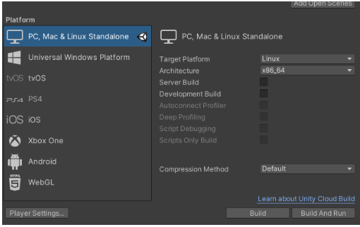
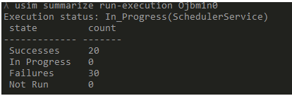

# Getting Started with SynthDet

The goal of the workflow steps is to provide you with everything that you need to get started using the SynthDet project to create a synthetic dataset of grocery products and use that dataset to train a Faster R-CNN object detection model. Please verify that you have received the $100 credit when signing up for Unity Simulation as some steps require runs and downloads of data from Unity Simulation.

* User will get a $100 credit for use in Unity Simulation that is valid for 30 days

## Workflow (Step-by-step)

### Step 1: Open the SynthDet Sample project
Verify you can open the project and the example scene runs and generates data locally on your machine.

1. In the SynthDet [repository you cloned](https://github.cds.internal.unity3d.com/unity/google-dr-paper/tree/master)
    1. In a command prompt navigate to the root folder and run the command **git submodule update --init --recursive**
    2. Open the example project in the root called SynthDet 
2. In the Scenes folder open the MainScene 
3. Press play and observe the different products quickly being generated in the game view
4. To view the files being generated in a file explorer navigate to the following location: Application Perstaint file path + .\UnityTechnologies\SynthDet
    1. Example file path on Windows: "/Users/<User Name>/AppData/LocalLow/UnityTechnologies/SynthDet"
    2. Example file path on Mac "/Users/<User name>/Library/Application Support/UnityTechnologies/SynthDet/"

### Step 2: Connect to Cloud Services 
The project will need to be connected to cloud services and a org id in order to access Unity Simulations in the cloud services 

1. To run the app on Unity Simulation, connect to cloud services and create a new Unity Project ID using the following steps:
    1. In the top right corner of the editor click the cloud button
        1. This will open the “Services” tab

2. Make sure you are logged into your Unity account as well
3. Create a new Unity Project ID 

4. When creating your project ID make sure select the desired organization for the project

5. Here is a [Unity link](https://docs.unity3d.com/Manual/SettingUpProjectServices.html) for the services creation in case further information is needed

### Step 3: Preparing a Build in Unity Editor 
Once the project is connected to cloud services a Linux build needs to be created so Unity Simulation can run the build and generate a dataset. This section of instruction will be a guide on how to create a build, kick off a run in Unity Simulation, and download the data created by the run.

#### Creating the Build
1. Open File -> Build Settings...
2. Switch the target platform to Linux 

3. Create a Linux build of the project by "clicking" Build
    1. When the prompt for where to save the build opens, create a new folder for the build in the root of the project to be saved
    2. For example in this sample a good folder structure is <Project Path>/Build/LinuxBuild 

#### Preparing the Unity Simulation Build
Unity Simulation does have a cost associated with running builds on the cpu nodes in the cloud, however a $100 credit is issued to users trying Unity Simulation with SynthDet. In this section we're going to show how to properly set up the file structure of a linux build manually so you can upload that build to Unity Simulation and have a dataset created.
If you run into issues please check [Unity Simulation Help and Information](UnitySimulationHelpInformation.md) 

1. Once the Linux build is complete navigate to your Build folder, i.e. <Project>\Build\LinuxBuild and use a utility to zip the build
    1. It is important to zip the build so the root folder contains only the created build files for the build. If the build contains a root folder within a root folder Unity Simulation will fail to grab the build
    2. You can do this by selecting all the files in the Linux build directory and then right clicking <PlayerBuild>.x86_64 and then clicking send to a zip folder
    3. Verify that the zip contains only the files from the build
        1. If you open the zip and you see a folder that contains the build files inside that folder the build will fail in Unity Simulation

2. Start a run in Unity Simulation using the Run in USim window, once the run is executed it will take time ~ 10 mins for the run to complete 
    1. Under Window -> Run in USim…
    2. Fill out the Run name with an example name i.e. SynthDetTestRun
    3. Fill out the path to player build.zip you created in step 1.2 of the "Preparing the Unity Simulation Build"
    4. If you are curious about the parameters in this window check out the [Unity Simulation information guide](UnitySimulationHelpInformation.md)

3. Click “Execute in Unity Simulation”
    1. This will take some time for the runs to complete and the editor may appear frozen however it is executing the run
4. Once the run is complete check the console log and take note and copy down the run-execution id from the debug message

### Step 4: Download manifest from Unity Simulation
Once the Unity Simulation run has been executed, the run needs to be verified that it has completed. Once a run has completed the manifest can be downloaded and the results verified locally.

1. Check the current summary of the execution run in Unity Simulation since we need the run to be completed 
    1. Open a command line interface and navigate to the USim CLI for your platform 
    2. Run the command usim login auth, this will authorize your account and log in
    3. In the command window run this command `summarize run-execution <execution id>`
        1. If you receive an error about the active project please go to [Unity Simulation Help](UnitySimulationHelpInformation.md)
        2. The command may need to be ran few times because you don’t want to continue until the run reports that it has completed 

2. Next we need to download the data manifest from the run and check the data 
    1. Run the cmd `usim download manifest <execution id>`
    2. This will download a csv file that will contain links to the generated data and manifest
    3. Verify some of the data looks good before continuing

### Step 5: Creating and using a Notebook for Model Training 
This section will be a guide for creating a personal notebook based off a particular git commit in order to run Thea. Thea is a python tool used to create trained models based off of the dataset created in Unity Simulations. By the end of the section you will be able to use a notebook to create a trained model based off of a dataset.

1. This command mounted directory $home/data in your local filesystem to /data inside the container. If you have saved your data to a different location, change the local directory path to match the directory where the synthetic data is stored
    1. docker run -p 8888:8888 -v <Synthetic Data File Path/data>:/data -t unitytechnologies/datasetinsights:0.0.1

## Opening the docker image locally
1. There are two options for opening the docker image locally  
    1. In a internet browser go to http://localhost:8888 in a web browser to open the notebook
    
    
    
    2. Open the Docker Dashboard and select the image that was created using thea, then select open in browser in the top right ribbon 

    

#### Run the notebook 
1. Make sure that the local webpage for the image is open

2. Open the folder thea/notebooks in the local page directory 
    1. Locate the notebook called SynthDet_Statistics 
    

3. Open the SynthDet_Statistics notebook
    1. Uncomment the code by deleting the # to match the image below 
        
    2. In the section Unity Simulation section update the run_execution_id and the auth_token
        1. You can get auth_token by following: [Unity Simulation Quickstart](https://github.com/Unity-Technologies/Unity-Simulation-Docs/blob/master/doc/quickstart.md)

4. Click Cell->Run All at the top of the notebook, this will run through the notebook sections

5. The notebook will start generating graphs to organize the metrics for the model
