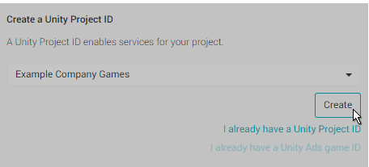
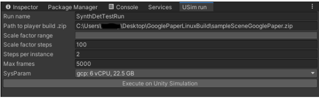

# Running SynthDet in Unity Simulation


This walkthrough demonstrates how to use Unity Simulation to generate a dataset at scale.

Unity Simulation is still in development. To use it, sign up for the [Unity Simulation Beta.](https://unity.com/products/simulation)

## Workflow

### Step 1: Set up additional prerequisites
See [Prerequisites: Additional requirements for running in Unity Simulation](Prerequisites.md).

### Step 2: Open the SynthDet sample project
See [Getting Started with SynthDet](GettingStartedSynthDet.md) and follow steps 1 and 2. 

### Step 3: Connect to Cloud Services 
To access Unity Simulations in Unity Cloud Services, the project must be connected to Cloud Services and an org ID. To run the app on Unity Simulation, connect to Cloud Services and create a new Unity Project ID using the following steps:

1. In the top-right corner of the Editor click the cloud icon. This opens the Services tab. 


2. Ensure you are logged into your Unity account
3. Create a new Unity Project ID 


4. When creating your project ID, select the organization you want for the project



For more information, see documentation on [Setting up your project for Unity Services](https://docs.unity3d.com/Manual/SettingUpProjectServices.html). 

### Step 4: Run SynthDet in Unity Simulation

1. To run SynthDet in Unity Simulation, open the Run in Unity Simulation window (menu: **Window** > **Run in Usim**). For information on the parameters in this window see the [Unity Simulation information guide](UnitySimulationHelpInformation.md).
    1. Click **Window** > **Run in USim…**
    2. Enter a name in the **Run Name** field (for example "SynthDetTestRun")



2. Select **Execute on Unity Simulation**. It takes around ten minutes for a run to complete and the Editor might seem frozen while it is executing the run.
3. When the run is complete, check the console log and take note of the **Execution ID** and **build id** from the debug message: 


For troubleshooting, see [Unity Simulation help and information](UnitySimulationHelpInformation.md). 

### Step 5: Monitor status using Unity Simulation CLI
When the Unity Simulation run finishes its execution, you need to verify that it has correctly completed the run.

To check the current summary of the Unity Simulation execution run:

1. Open a command line interface and navigate to the USim CLI for your platform 
2. Enter the command `usim login auth`. This authorizes your account and logs in.
3. Enter the command `summarize run-execution <execution id>`

You should run the command until the Execution Status reads Completed. If you receive an error about the active project, see Unity Simulation Help. 


After execution is complete, you can download the manifest and check the generated data. To do this, enter the command `usim download manifest <execution id>`. 

This downloads a CSV file that contains links to the generated data. You can use this to check that the data looks good before you continue. 

### Step 6: Run dataset statistics using the datasetinsights Jupyter notebook

1. Use the following command to run the `datasetinsights` docker image from DockerHub using the following command:

```docker run -p 8888:8888 -v $HOME/data:/data -t unitytechnologies/datasetinsights:latest```

Replace `$HOME/data` with the path you want to download the dataset to.

> If you experience issues with Docker on Windows, see [Docker documentation](Docker.md).

2. Open Jupyter. To do this, open a web browser and navigate to http://localhost:8888
   
    

3. In Jupyter, navigate to `datasetinsights/notebooks`
4. Open the notebook called SynthDet_Statistics.ipynb 

    

5. Follow the Unity Simulation instructions in SynthDet_Statistics.ipynb to compute dataset statistics
